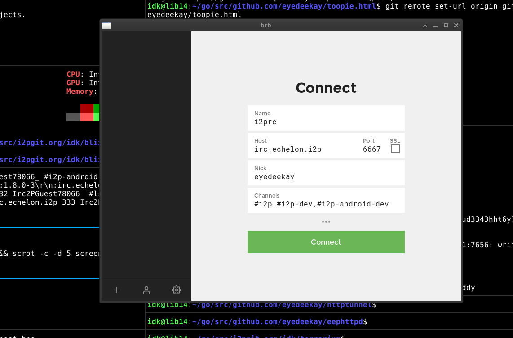

brb
===

*A pseudonymous software for groupchat based on IRC.*

**BRB incoroporates:**

An IRC Client - The actual IRC client is *[khlieng/dispatch](https://github.com/khlieng/dispatch)*
and they deserve most of the credit! All I did was add I2P support to
their application, then wrap it up in the interface I happen to think
was the most logical. In it's most basic use-case, it's an easy-to-use
modern client to the Irc2P network or any in-I2P IRC server.

Dispatch is the reason I call the client "Blue Rubber Band," because print newspapers
are often called "Dispatches" and in the US are frequently "Bound" in thin blue rubber
bands.

BRB also wraps up an IRC server, using *[terrarium](https://i2pgit.org/idk/terrarium)*,
a spin-off of another IRC server called *[horgh/catbox](https://github.com/horgh/catbox)*,
which I picked because it had relatively few features and a simple, self-contained
implementation. In older versions it used an IRC server called *[prologic/eris](https://git.mills.io/prologic/eris)*
which also has easy-to-setup I2P support.

Lastly, using [eyedeekay/sam-forwarder](https://github.com/eyedeekay/sam-forwarder),
the WebIRC interface provided by *Dispatch* is then forwarded back to the I2P network
as an I2P Site. In this way, anyone who connects to your Dispatch interface over I2P
can chat with you or others without the conversation leaving the server hosting the
*Dispatch/Terrarium* combination instance. When used in this way, it could act as an
anonymous replacement for something like Slack or Discord.

In addition to that, it sets up:

 1. **A taskbar icon:** using the [getlantern/systray](https://github.com/getlantern/systray)
  library and an accompanying menu, which can be used to launch the IRC client interface.
 2. **A menu** clicking the taskbar icon will open the menu, which presents
  options for launching the webview, connecting the webview to either I2PRC
  or your own private IRC server provided by the local Eris instance, and
  a panel to check the health of your I2P router.
 3. **A Webview:** using the [webview/webview](https://github.com/webview/webview)
  library. It's configured to proxy all traffic to I2P via the default
  HTTP proxy, *except* for traffic which is destined for the dispatch
  IRC client. This makes it capable of browsing I2P sites. It is
  **not reccommended** that you use this feature for general I2P browsing,
  but it should be ok for opening links from parties **who you trust** to
  give you the link.
 4. **An I2P Diagnostic View:** using the [I2PControl API](https://geti2p.net/en/docs/api/i2pcontrol)
  we connect to I2P to gather information about it's readiness in another
  webview.

The result is a Modern-looking, no fuss Irc2P Client.

Android Support
---------------

brb is also available experimentally for Android. In this case, the webview
parts are provided by the corresponding Android APIs. The final goal of the
Android application is to implement all the same features as the Desktop
application, including the Eris server. In this case, instead of a 
**taskbar icon** and a **menu** BRB provides:

 1. **A Foreground Service:** The Go parts of BRB are adapted to be "runnable"
  and controlled by a Foreground Service. This makes BRB "Work" on Android,
  but it doesn't have a menu to expose any of it's features.
 2. **A NotificationArea with a tray menu:** To set up the means to launch into
  various parts of the BRB app, a NotificationArea is added(persistently) into
  the toolbar at the top of your Android device's UI. It has the same buttons as
  the Menu on the desktop.

Enable the SAM API!
-------------------

brb uses the SAM API to set up it's connection to IRC networks inside of I2P.
This means that it can support as many IRC networks as you want to connect to.
With i2pd, the SAM API is already enabled. With Java I2P, you must enable it
on the [Config Clients](http://localhost:7657/configclients) page.

  >> `If you do not want to use either the WebView or Chromium to wrap the
  user-interface, you can instead use any web browser and direct it to
  localhost:7669. There is a container tab for this in
  [I2P in Private Browsing](https://github.com/eyedeekay/I2P-in-Private-Browsing-Mode-Firefox).
  This should be a reasonable baseline for non-sensitive I2P browsing.`
